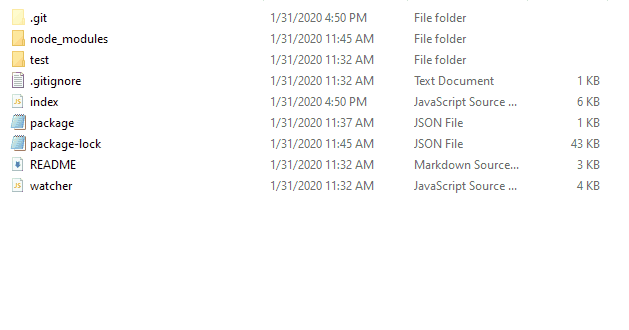
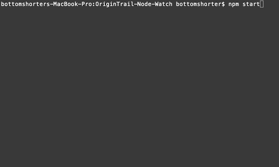

## OriginTrail-Node-Watch

Thank you for making your way onto my GitHub. After taking a web development class, I decided to take a stab at a little software. This is a side project I've been working on for OriginTrail Nodes. Please feel free to contribute and make a pull request for new features.

__THIS BOT IS HOSTED LOCALLY ON YOUR MACHINE JUST LIKE HOUSTON__ 

## Pre-liminary Steps:

A.) Open Terminal/Command Prompt

B.) Execute the following: 

	cd Desktop

## Step 1
   Once you are navigated to the Desktop, clone the repo and navigate into the folder and to install dependencies type in cmd:
	
	git clone https://github.com/bottomshorter/OriginTrail-Node-Watch.git
	
	cd OriginTrail-Node-Watch

	npm install
	
## Preliminary Steps and Step 1 Visual

## Step 2
   Go to your Telegram application, and start a new conversation with 'BotFather' via https://t.me/botfather

## Step 3
   Create a new bot by using the command /newbot

## Step 4
   Give it a username | ex.. "OriginTrailNodeWatch"

## Step 5
   Give the bot a "bot" name | ex.. OriginTrailNodeBot

## Step 6
After your bot has been created, BotFather will send you a 'token' for access to the Telegram HTTP API, and it will also send you a link to talk to your bot.

	NOTE: DO NOT SHARE YOUR API KEY WITH ANYONE FOR SECURITY REASONS

## Step 2 through Step 6 Visual

## Step 7

If you are using a code editor proceed to step 8a, if not and you are using command console, skip to step 8b.

## Step 8a

Go into the cloned repo folder and edit line 6 of the index.js file and change APIKEY to the one generated by BotFather, leave the (' ')

Line 6 should look similar to this in order to be functional:

	const bot = new Telegraf('525312139:Blahblah462Z0oy7ZpoBLAHuYCcFBLAHBLAH')

## Step 8b

Navigate into the cloned folder and do the following edit index.js with notepad:

Then find the line with: 
	
	const bot = new Telegraf('APIKEY')

Replace APIKEY with the one generated by BotFather and it will look similar to this:

	const bot = new Telegraf('525312139:Blahblah462Z0oy7ZpoBLAHuYCcFBLAHBLAH')
	
	

## Step 9

Save the file and go into command console and type: npm start

## Step 10
10.) After your console says 'bot is running... Start a conversation **(using the link generated in step 6)** with your bot and type /start to begin using the bot to add your nodes

## Troubleshooting

If you get this error, please make sure you are pressing **save** after your APIKEY is put into notepad / the code editor.

## Side Notes

**Since this is in alpha, you will have to keep your command console/terminal open during the use of your bot. Further versions will guide the user how to install and just run on your OTNODE**

## How to preload nodes onto the bot
You may have noticed that every time your command console / terminal is exited, your bot will not respond or function, and it will also forget which nodes you added. To solve this, look below.

If you would like to add your nodes into the NodesWatched array so you don't have to add them each time you start up the bot, just added your ERC725 Identities into the NodesWatched array with following syntax:

var NodesWatched = ['ERC725 ID #1', 'ERC725 ID #2' , 'ERC725 ID #X', '...']
